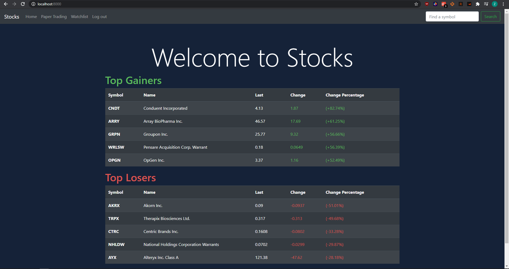

# Paper Trading

This web app allows users to simulate trading stocks using real world data. Users can log in and manage their positions by buying or selling shares.
A money counter tracks the user's net profit. Additionally, users can search for stocks and get their current price along with the day change of the 
stock. On the home page, users can see the top five gainers and losers in the market. Finally, users have access to a private watchlist which they 
can add stocks to for easy access.

Home Page


Search


Watchlist


Paper Trading


## Getting Started

These instructions will get you a copy of the project up and running on your local machine for development and testing purposes.

### Prerequisite

[Python](https://www.python.org/downloads/)

### Installing
Clone the repository.

```
pip install django
pip install python-dotenv
pip install django-environ
pip install django-crispy-forms
pip install requests
```
Create a .env file that follows the sample with [Finnhub](https://finnhub.io/) and [Financial Modeling Prep](https://financialmodelingprep.com/) API keys respectively.
```
python manage.py migrate
python manage.py runserver
```
Navigate to localhost:8000

## Built With

* [Django](https://www.djangoproject.com/) - The web framework used
* [Bootstrap](https://getbootstrap.com/) - Stylizing the webpage

## Acknowledgments

* [README Template](https://gist.github.com/PurpleBooth/109311bb0361f32d87a2) credits
